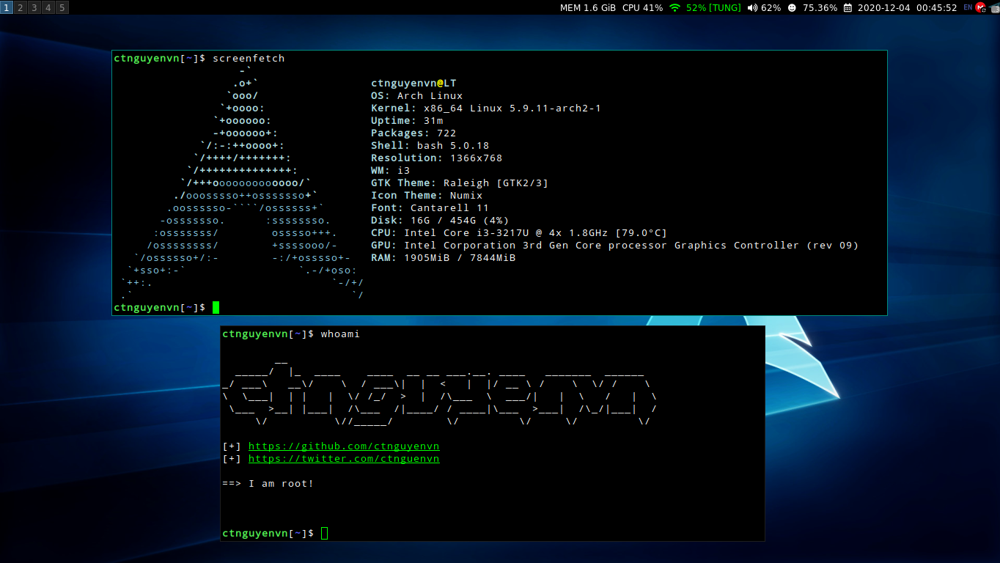

## Myi3
I3wm simple: urxvt, sublime text, vim, etc

## Dependencies
* Feh
* dmenu
* Awesome Font
* NetworkManager-applet
* i3-wm
* i3lock-color
* pulseaudio
* xbacklight
* imagemagick

## My vim config

My vim config is [here](https://github.com/ctnguyenvn/vimrc) or install with:

```
git clone https://github.com/ctnguyenvn/vimrc
cd vimrc && bash install.sh
```

## TODO list

- [x] change colors
- [x] add new screenshot
- [x] create/install package for dependencies
- [ ] add installer
- [x] change i3-status config
- [x] add ibus-unikey

## ScreenShot
my config screenshot

